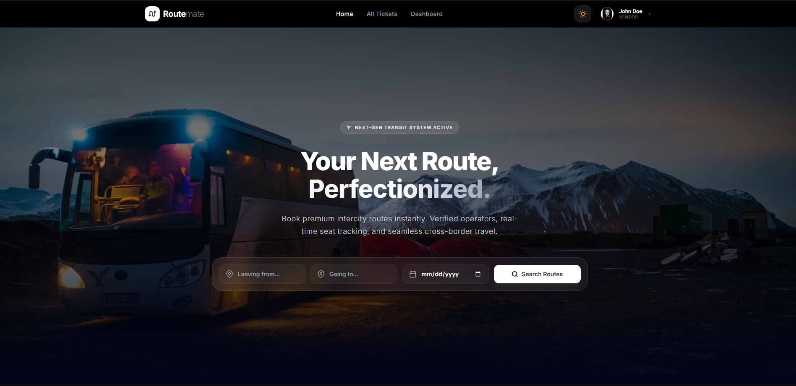

<p align="center">
  
</p>

# 🚀 RouteMate

### **Modern Utility Travel Ticketing & Vendor Management Matrix**

RouteMate is a high-fidelity, utility-first travel ticket procurement and vendor logistics management platform. Engineered for seamless deployment on the Next.js App Router and optimized with a robust Node.js/Mongoose ecosystem, it enables transit operators to orchestrate route listings, audit ticket allocations, and review transaction ledgers with extreme precision.

---

## 🎯 Purpose & Scope

In modern transit ecosystems, legacy ticketing software suffers from high latency and rigid interfaces. **RouteMate** reclaims efficiency by providing vendors with an agile, high-performance portal to manage target route pathing, inventory availability, and localized structural data. It serves as an end-to-end framework bridges secure administrative auditing with dynamic consumer-facing route options.

- **Live Application URL:** [Live Link](https://routemate-six.vercel.app/) _(Live Preview)_

---

## ✨ Key Capabilities & User Features

### 🏢 Vendor Operations Control Panel

- **Asset Management Pipeline (CRUD):** Complete control mechanics to instantiate, track, and update ticket route entries. Customize unit costs, structural route tags, and real-time seat volume pools safely.
- **Localized Route Mappings:** Explicit mapping definitions containing origin nodes (`fromLocation`), target vectors (`toLocation`), transit mode markers (`transportType`), and chronological dispatch stamps (`departureTime`).
- **Administrative Quarantine Workflows:** Automated visual indicators tracking ticket status matrices (`pending`, `approved`, or `rejected`). Interactive state blocks safely restrict modifying assets flagged by terminal managers.

### 🔐 Security & Structural Engine

- **Identity Alignment Infrastructure:** Streamlined session allocation via synchronized security client tokens, establishing state-locked authorization headers for all state mutations.
- **Fluid User Experience Layers:** Intercepts critical execution signals (such as resource purges) via custom-animated Framer Motion confirm sheets, discarding jarring native browser alerts for enhanced interface continuousness.
- **Modern Utility UI Layouts:** Adaptive 3-column micro-grid structure offering responsive, edge-to-edge content presentation optimized perfectly across small mobile viewports and large multi-task arrays.

---

## 📦 Core Technical Stack & Package Registry

### Frontend Core Architecture

| Package Module          | Classification | Functional Role in Matrix                                                                             |
| :---------------------- | :------------- | :---------------------------------------------------------------------------------------------------- |
| `next` (v16)            | Framework      | Structural React Core, Dynamic Routing, & Server Actions                                              |
| `framer-motion`         | Engineering UI | Orchestrates smooth, hardware-accelerated viewport transitions & custom modal layouts                 |
| `react-icons` (Fi Pack) | UI Polish      | Provides scalable, lightweight vector iconography for cross-platform interface scannability           |
| `react-toastify`        | UX Diagnostics | Handles instant asynchronous notification status feedback loops for inline backend logic              |
| `@better-auth/react`    | Security       | Manages customer-to-vendor identity mapping and unified state authorization tokens                    |
| `tailwindcss`           | Design Engine  | Delivers the "Modern Utility" visual foundations, high-fidelity spacing tokens, and clean grid layers |

### Backend Framework Matrix

| Package Module    | Classification | Functional Role in Matrix                                                                      |
| :---------------- | :------------- | :--------------------------------------------------------------------------------------------- |
| `express`         | Core Routing   | Handles transactional routing pipelines and incoming controller signals                        |
| `mongodb adapter` | Data Modeling  | Shapes the ticket configuration schematics, schema validations, and MongoDB aggregation layers |
| `jwt & jwks`      | Protection     | Shapes the backend api routes with authentication and authorization                            |

---

## 🚀 Local Initialization Protocols

### 1. Replicate Project Repositories

```bash
git clone https://github.com/codeHasib/routemate.git
cd routemate
```

### 2. Dependencies Sync Execution

```bash
npm install
```

### 3. Environment Variable Calibration

Create a `.env.local` manifest file within the client directory root structure:

```env
NEXT_PUBLIC_APP_URL=http://localhost:3000
NEXT_PUBLIC_BACKEND_API_MATRIX=https://routemate-backend-nine.vercel.app
```

### 4. Initiate Development Environment

```bash
npm run dev
```

Open [http://localhost:3000](http://localhost:3000) with your local browser layout to test the system matrix.

---

## 🛡️ Administrative Maintenance Rules

> **Operational Note:** Always make sure route mutation strategies utilize target parameter verification. Any endpoint validation mismatch will cause immediate rejection in the modification pipeline to preserve database configuration health.
